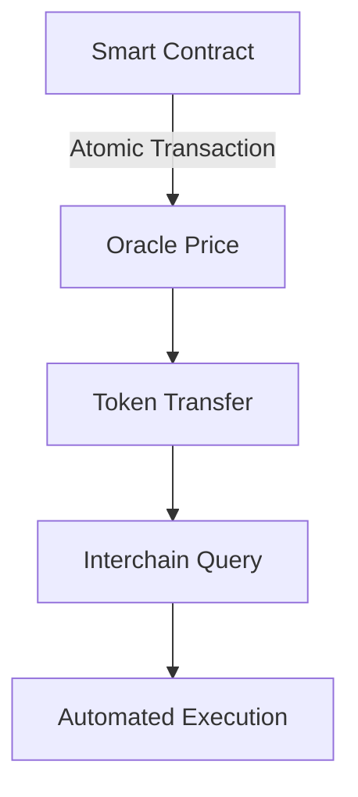

# Integrated Architecture

Unlike generalized L1s that provide generic infrastructure, Neutron implements an integrated blockchain architecture focusing exclusively on DeFi by making highly-performant, application-specific infrastructure available to protocols within a shared execution environment.

## What is an Integrated Architecture?

An integrated architecture is one where critical DeFi infrastructure components are built directly into the protocol layer, rather than being implemented as smart contracts or external services. This approach ensures:

- Guaranteed per-block execution
- Native cross-chain communication
- Atomic composability across all components
- Built-in high-frequency oracle services
- Predictable gas costs and performance

This tailored approach allows entrepreneurs to build new types of protocols that improve capital efficiency, profitability, and user experience — all within a shared execution environment that ensures atomic composability.

## Core Components

<CardGroup cols={2}>
  <Card title="High-Frequency Oracle" icon="bolt">
    Native price feeds updated every block with hardware-based security, eliminating dependence on external oracles and providing superior execution guarantees.
  </Card>
  <Card title="Interchain Queries (ICQ)" icon="network-wired">
    Direct state queries across any IBC-connected chain, enabling real-time cross-chain data access without trusted third parties.
  </Card>
  <Card title="Automated Execution" icon="clock">
    Native automation through the Cron module, allowing scheduled and conditional contract execution with protocol-level reliability.
  </Card>
  <Card title="Interchain Transactions (ICTX)" icon="arrows-left-right">
    Built-in interchain account management enabling seamless cross-chain operations with consensus-enforced security.
  </Card>
</CardGroup>

## Benefits of Integration

### 1. Capital Efficiency
- Optimized liquidity utilization across protocols
- Reduced capital requirements through composability
- Democratized access to financial opportunities

### 2. Reliability
- Infrastructure failures are consensus failures
- No external dependencies for critical operations
- Guaranteed execution within block boundaries

### 3. Performance
- Direct state access without contract calls
- Optimized gas costs for common operations
- High-frequency oracle updates every block

### 4. Security
- Protocol-level validation of all operations
- No trusted external oracles or bridges
- Consensus-enforced safety guarantees

## Atomic Composability

Neutron's integrated architecture enables true atomic composability across all protocol features:

All operations within a transaction either succeed together or fail together, with no partial execution states.

## Real-World Applications

### Supervaults
Supervaults represent a new approach to liquidity provision that overcomes the limitations of traditional AMMs. By leveraging Neutron's built-in high-frequency oracle and native automation features, Supervaults can:

- Market make at the most recent CEX prices
- Automatically rebalance every block
- Perform arbitrage themselves instead of being arbitraged
- Democratize profits to liquidity providers
- Lower the cost of capital acquisition

### Cross-Chain Liquid Staking
Protocols can utilize Neutron's custom Interchain Transactions (ICTX) and Interchain Queries (ICQ) modules to:

- Read the state of other blockchains
- Adjust delegations made by remotely controlled accounts
- Onboard new assets from connected chains with a single transaction
- Provide users with a seamless cross-chain staking experience

## Module Integration

<CardGroup cols={2}>
  <Card title="Oracle Module" icon="chart-line" href="/developers/modules/oracle">
    High-frequency price feeds with hardware security
  </Card>
  <Card title="ICQ Module" icon="network-wired" href="/developers/modules/interchain-queries">
    Cross-chain state queries and verification
  </Card>
  <Card title="Cron Module" icon="clock" href="/developers/modules/cron">
    Automated and scheduled execution
  </Card>
  <Card title="ICA Module" icon="arrows-left-right" href="/developers/modules/interchain-accounts">
    Interchain account management
  </Card>
</CardGroup>

<Note>
  Neutron's integrated architecture overcomes the limitations of both generalized L1s and app-specific chains by providing tailored DeFi infrastructure with atomic composability, creating a more capital-efficient, profitable, and convenient decentralized economy.
</Note> 