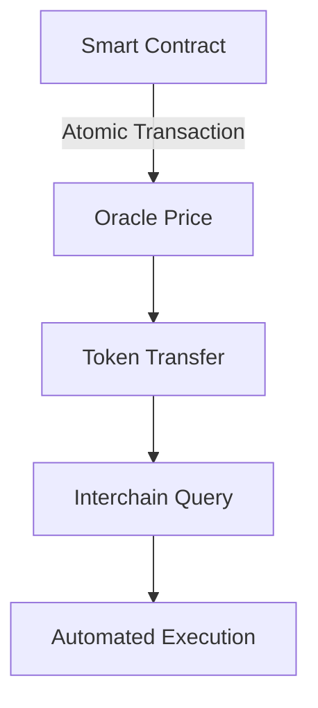

Neutron's integrated architecture represents a fundamental shift in blockchain design, combining high-performance infrastructure with atomic composability in a single, unified state machine.

## What is an Integrated Architecture?

An integrated architecture is one where critical DeFi infrastructure components are built directly into the protocol layer, rather than being implemented as smart contracts or external services. This approach ensures:

- Guaranteed per-block execution
- Native cross-chain communication
- Atomic composability across all components
- Predictable gas costs and performance

## Core Components

<CardGroup cols={2}>
  <Card title="High-Frequency Oracle" icon="bolt">
    Native price feeds updated every block with hardware-based security and consensus stability improvements.
  </Card>
  <Card title="Interchain Queries" icon="network-wired">
    Direct state queries across any IBC-connected chain, enabling real-time cross-chain data access.
  </Card>
  <Card title="Automated Execution" icon="clock">
    Native automation through the Cron module, allowing scheduled and conditional contract execution.
  </Card>
  <Card title="Token Factory" icon="coins">
    Built-in token creation and management with standardized interfaces and security guarantees.
  </Card>
</CardGroup>

## Benefits of Integration

### 1. Reliability
- Infrastructure failures are consensus failures
- No external dependencies for critical operations
- Guaranteed execution within block boundaries

### 2. Performance
- Direct state access without contract calls
- Optimized gas costs for common operations
- Parallel execution where possible

### 3. Security
- Protocol-level validation of all operations
- No trusted external oracles or bridges
- Consensus-enforced safety guarantees

### 4. Developer Experience
- Simplified integration through standard interfaces
- Reduced infrastructure maintenance
- Native support for common DeFi primitives

## Atomic Composability

Neutron's integrated architecture enables true atomic composability across all protocol features:

All operations within a transaction either succeed together or fail together, with no partial execution states.

## Module Integration

<CardGroup cols={2}>
  <Card title="Oracle Module" icon="chart-line" href="/developers/modules/oracle">
    High-frequency price feeds with hardware security
  </Card>
  <Card title="ICQ Module" icon="network-wired" href="/developers/modules/icq">
    Cross-chain state queries and verification
  </Card>
  <Card title="Cron Module" icon="clock" href="/developers/modules/cron">
    Automated and scheduled execution
  </Card>
  <Card title="Token Factory" icon="coins" href="/developers/modules/token-factory">
    Native token creation and management
  </Card>
</CardGroup>

## Example: Integrated DeFi Flow

Here's how Neutron's integrated architecture enables complex DeFi operations in a single atomic transaction:

1. Query cross-chain collateral prices via ICQ
2. Verify prices through the Oracle module
3. Execute token swaps via Token Factory
4. Schedule future rebalancing via Cron

All these operations are executed atomically within the same block, with protocol-level guarantees for reliability and consistency.

<Note>
  Neutron's integrated architecture is designed to provide the reliability and performance of app-specific chains while maintaining the flexibility and composability of general-purpose blockchains.
</Note> 