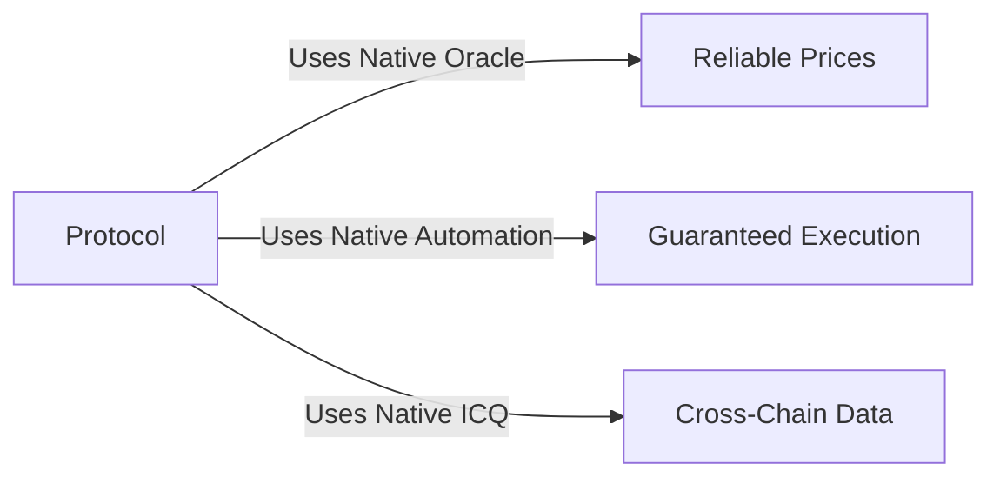

Neutron takes an opinionated approach to blockchain design, making deliberate choices about infrastructure, security, and user experience to create an optimal environment for DeFi applications.

## What are Opinionated Blockchains?

Opinionated blockchains make explicit architectural decisions about core infrastructure, rather than leaving these choices to application developers. This approach:

- Ensures consistent behavior across the ecosystem
- Reduces duplicated infrastructure
- Guarantees security properties at the protocol level
- Creates a more unified developer and user experience

## Core Opinions

<CardGroup cols={2}>
  <Card title="Infrastructure First" icon="layer-group">
    Critical DeFi infrastructure is built directly into the protocol layer, ensuring reliability and composability.
  </Card>
  <Card title="Security by Design" icon="shield-halved">
    Security properties are guaranteed by consensus rather than delegated to external systems.
  </Card>
  <Card title="User-Centric" icon="users">
    Protocol design prioritizes user experience and accessibility over maximum flexibility.
  </Card>
  <Card title="Atomic Composability" icon="puzzle-piece">
    All operations within the system must maintain atomic composability for predictable behavior.
  </Card>
</CardGroup>

## Key Design Decisions

### 1. Protocol-Level Infrastructure
- Oracle price feeds are consensus-validated
- Cross-chain communication is native and trustless
- Automation is guaranteed by the protocol
- Token standards are enforced at the protocol level

### 2. Security Model
- No slashing in the proof-of-stake system
- Curated validator set for enhanced security
- Hardware-based security for critical operations
- Protocol-enforced rate limiting

### 3. User Experience
- Predictable gas costs
- Simplified staking mechanics
- Transparent governance processes
- Consistent behavior across applications

## Benefits of Opinionation

<CardGroup cols={2}>
  <Card title="For Developers" icon="code">
    - Reduced infrastructure overhead
    - Standardized interfaces
    - Guaranteed security properties
    - Simplified integration
  </Card>
  <Card title="For Users" icon="user">
    - Consistent experience
    - Predictable costs
    - Enhanced security
    - Better composability
  </Card>
</CardGroup>

## Comparison with Other Approaches

### Traditional L1s
- Maximally flexible but require duplicate infrastructure
- Security properties vary by application
- Inconsistent user experience
- Limited composability

### App-Specific Chains
- Optimized for single use case
- Limited flexibility
- Isolated ecosystems
- Complex cross-chain communication

### Neutron's Approach
- Optimized for DeFi while maintaining flexibility
- Consistent security and behavior
- Native cross-chain communication
- True atomic composability

## Real-World Impact

### DeFi Protocols

### User Benefits
- No unexpected slashing events
- Predictable transaction costs
- Consistent interface across apps
- Enhanced security guarantees

## Protocol Examples

<CardGroup cols={2}>
  <Card title="Supervaults" icon="vault" href="/users/defi/supervaults">
    Leverages native infrastructure for automated yield strategies
  </Card>
  <Card title="Drop Protocol" icon="droplet" href="/users/defi/drop">
    Uses integrated staking and cross-chain communication
  </Card>
</CardGroup>

<Note>
  Neutron's opinionated design choices create a more reliable, secure, and user-friendly DeFi ecosystem while maintaining the flexibility needed for innovation.
</Note> 