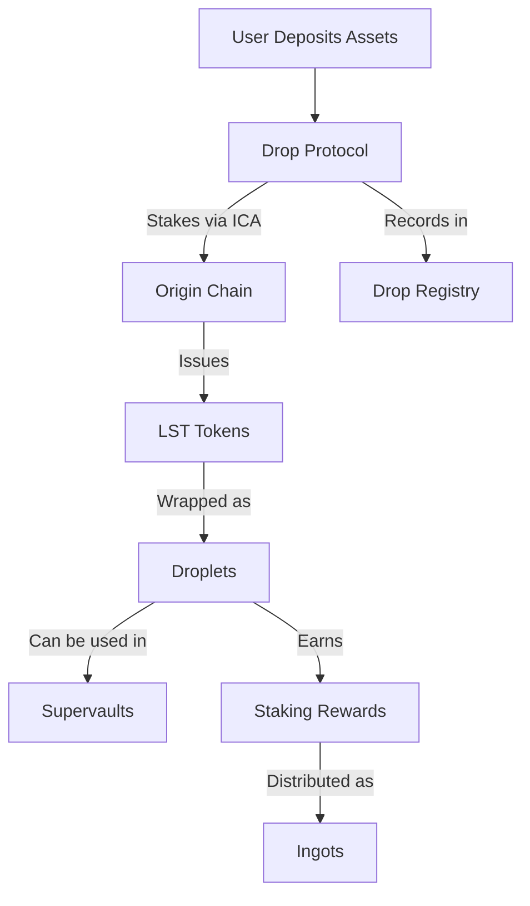

# Cross-Chain Liquid Staking with Drop Protocol

Drop is Neutron's innovative liquid staking protocol, designed to bring cross-chain liquid staking tokens (LSTs) to the DeFi ecosystem with seamless interoperability and enhanced capital efficiency.

## What is Drop Protocol?

  Drop Protocol enables users to access liquid staking across multiple chains through a unified, capital-efficient interface on Neutron. It leverages Lido's infrastructure to provide secure, battle-tested liquid staking with enhanced composability.

## Key Features

  

    

      <svg xmlns="http://www.w3.org/2000/svg" viewBox="0 0 24 24" fill="currentColor" className="w-8 h-8">
        <path fillRule="evenodd" d="M12 1.5a.75.75 0 01.75.75V4.5a.75.75 0 01-1.5 0V2.25A.75.75 0 0112 1.5zM5.636 4.136a.75.75 0 011.06 0l1.592 1.591a.75.75 0 01-1.061 1.06l-1.591-1.59a.75.75 0 010-1.061zm12.728 0a.75.75 0 010 1.06l-1.591 1.592a.75.75 0 01-1.06-1.061l1.59-1.591a.75.75 0 011.061 0zm-6.816 4.496a.75.75 0 01.82.311l5.228 7.917a.75.75 0 01-.777 1.148l-2.097-.43 1.045 3.9a.75.75 0 01-1.45.388l-1.044-3.899-1.601 1.42a.75.75 0 01-1.247-.606l.569-9.47a.75.75 0 01.554-.679zM3 10.5a.75.75 0 01.75-.75H6a.75.75 0 010 1.5H3.75A.75.75 0 013 10.5zm14.25 0a.75.75 0 01.75-.75h2.25a.75.75 0 010 1.5H18a.75.75 0 01-.75-.75zm-8.962 3.712a.75.75 0 010 1.061l-1.591 1.591a.75.75 0 11-1.061-1.06l1.591-1.592a.75.75 0 011.06 0z" clipRule="evenodd" />
      </svg>
    

    <h3 className="text-xl font-semibold mb-2">Multi-Chain Support</h3>
    
Access liquid staking tokens from 100+ chains through a single interface, simplifying cross-chain exposure.

  

  
  

    

      <svg xmlns="http://www.w3.org/2000/svg" viewBox="0 0 24 24" fill="currentColor" className="w-8 h-8">
        <path d="M4.5 3.75a3 3 0 00-3 3v.75h21v-.75a3 3 0 00-3-3h-15z" />
        <path fillRule="evenodd" d="M22.5 9.75h-21v7.5a3 3 0 003 3h15a3 3 0 003-3v-7.5zm-18 3.75a.75.75 0 01.75-.75h6a.75.75 0 010 1.5h-6a.75.75 0 01-.75-.75zm.75 2.25a.75.75 0 000 1.5h3a.75.75 0 000-1.5h-3z" clipRule="evenodd" />
      </svg>
    

    <h3 className="text-xl font-semibold mb-2">Lido Integration</h3>
    
Leverages Lido's trusted infrastructure for secure, non-custodial liquid staking with competitive yields.

  

  
  

    

      <svg xmlns="http://www.w3.org/2000/svg" viewBox="0 0 24 24" fill="currentColor" className="w-8 h-8">
        <path d="M5.566 4.657A4.505 4.505 0 016.75 4.5h10.5c.41 0 .806.055 1.183.157A3 3 0 0015.75 3h-7.5a3 3 0 00-2.684 1.657zM2.25 12a3 3 0 013-3h13.5a3 3 0 013 3v6a3 3 0 01-3 3H5.25a3 3 0 01-3-3v-6zM5.25 7.5c-.41 0-.806.055-1.184.157A3 3 0 016.75 6h10.5a3 3 0 012.684 1.657A4.505 4.505 0 0018.75 7.5H5.25z" />
      </svg>
    

    <h3 className="text-xl font-semibold mb-2">Droplets & Ingots</h3>
    
Innovative tokenomics with Droplets as receipt tokens and Ingots as reward tokens, creating dynamic yield strategies.

  

  
  

    

      <svg xmlns="http://www.w3.org/2000/svg" viewBox="0 0 24 24" fill="currentColor" className="w-8 h-8">
        <path fillRule="evenodd" d="M3 6a3 3 0 013-3h12a3 3 0 013 3v12a3 3 0 01-3 3H6a3 3 0 01-3-3V6zm4.5 7.5a.75.75 0 01.75.75v2.25a.75.75 0 01-1.5 0v-2.25a.75.75 0 01.75-.75zm3.75-1.5a.75.75 0 00-1.5 0v4.5a.75.75 0 001.5 0V12zm2.25-3a.75.75 0 01.75.75v6.75a.75.75 0 01-1.5 0V9.75A.75.75 0 0113.5 9zm3.75-1.5a.75.75 0 00-1.5 0v9a.75.75 0 001.5 0v-9z" clipRule="evenodd" />
      </svg>
    

    <h3 className="text-xl font-semibold mb-2">DeFi Composability</h3>
    
Seamlessly integrate with Supervaults and other Neutron DeFi products to maximize yield on liquid staked assets.

  

## How Drop Works

Drop Protocol facilitates liquid staking across the Cosmos ecosystem and beyond, leveraging Neutron's interchain capabilities:

### Technical Architecture

The protocol follows these steps:

1. Users deposit native assets (ATOM, OSMO, etc.) into Drop Protocol
2. Using interchain accounts, Drop stakes these assets on their respective chains
3. Droplet tokens are issued to users, representing their staked position
4. Staking rewards accrue to the protocol and are distributed to Droplet holders
5. Users can redeem their Droplets for the underlying staked assets plus rewards

## Benefits

  

    <h4 className="font-semibold mb-2">Enhanced Liquidity</h4>
    
Access deep liquidity markets for LSTs with minimal slippage through Neutron's Duality DEX and Supervaults.

  

  
  

    <h4 className="font-semibold mb-2">Improved Capital Efficiency</h4>
    
Use your staked assets as collateral or in yield strategies while continuing to earn staking rewards.

  

  
  

    <h4 className="font-semibold mb-2">Simplified Management</h4>
    
Manage all your staked positions across multiple chains from a single interface on Neutron.

  

## Assets Supported

  <table className="min-w-full border border-gray-300 dark:border-gray-700">
    <thead>
      <tr className="bg-gray-100 dark:bg-gray-800">
        <th className="p-3 text-left">Asset</th>
        <th className="p-3 text-left">Chain</th>
        <th className="p-3 text-left">Droplet Token</th>
        <th className="p-3 text-left">Estimated APR</th>
      </tr>
    </thead>
    <tbody>
      <tr className="border-t border-gray-300 dark:border-gray-700">
        <td className="p-3 font-medium">ATOM</td>
        <td className="p-3">Cosmos Hub</td>
        <td className="p-3">drpATOM</td>
        <td className="p-3">~8-12%</td>
      </tr>
      <tr className="border-t border-gray-300 dark:border-gray-700 bg-gray-50 dark:bg-gray-900">
        <td className="p-3 font-medium">OSMO</td>
        <td className="p-3">Osmosis</td>
        <td className="p-3">drpOSMO</td>
        <td className="p-3">~15-20%</td>
      </tr>
      <tr className="border-t border-gray-300 dark:border-gray-700">
        <td className="p-3 font-medium">NTRN</td>
        <td className="p-3">Neutron</td>
        <td className="p-3">drpNTRN</td>
        <td className="p-3">~3-5%</td>
      </tr>
      <tr className="border-t border-gray-300 dark:border-gray-700 bg-gray-50 dark:bg-gray-900">
        <td className="p-3 font-medium">Others</td>
        <td className="p-3">Various IBC Chains</td>
        <td className="p-3">Various</td>
        <td className="p-3">Varies</td>
      </tr>
    </tbody>
  </table>

## Get Started

  <a className="flex flex-col p-5 border border-gray-200 dark:border-gray-800 rounded-lg hover:bg-gray-50 dark:hover:bg-gray-900" href="#">
    <h4 className="font-semibold mb-2">Stake Assets</h4>
    
Deposit your assets to receive Droplet tokens and start earning rewards

  </a>
  
  <a className="flex flex-col p-5 border border-gray-200 dark:border-gray-800 rounded-lg hover:bg-gray-50 dark:hover:bg-gray-900" href="#">
    <h4 className="font-semibold mb-2">Use in DeFi</h4>
    
Deploy your Droplets in Supervaults or other DeFi protocols

  </a>
  
  <a className="flex flex-col p-5 border border-gray-200 dark:border-gray-800 rounded-lg hover:bg-gray-50 dark:hover:bg-gray-900" href="#">
    <h4 className="font-semibold mb-2">Claim Rewards</h4>
    
Collect your staking rewards and Ingot tokens

  </a>

  <strong>Note:</strong> Drop Protocol is continuously expanding its support for new chains and assets. Check back regularly for updates on newly supported tokens.

 