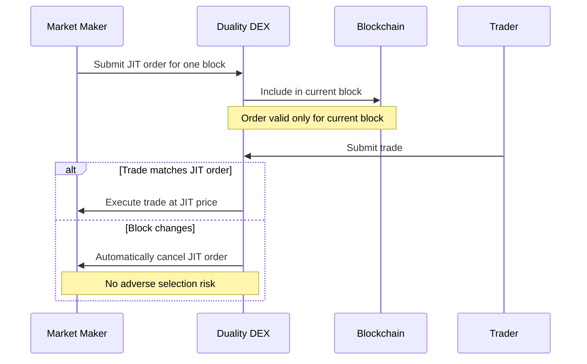

## Next Evolution in DeFi Trading

Duality is a high-performance DEX built into Neutron that combines the advantages of orderbooks and AMMs into a single trading venue. It is optimized to offer the best prices by supporting all market participants — professional market makers, traders, and passive liquidity providers — with advanced order types and features.

## What is Duality?

  Duality is a protocol-native DEX integrated directly into Neutron's core infrastructure. Unlike traditional DEXs implemented as smart contracts, Duality is built at the protocol level, giving it significant performance advantages and deeper integration with other Neutron features. It enables professional-grade market making with Just-In-Time (JIT) orders, limit orders, and other advanced features to create a more efficient trading environment.

## Key Features

  

    

      <svg xmlns="http://www.w3.org/2000/svg" viewBox="0 0 24 24" fill="currentColor" className="w-8 h-8">
        <path fillRule="evenodd" d="M12 2.25c-5.385 0-9.75 4.365-9.75 9.75s4.365 9.75 9.75 9.75 9.75-4.365 9.75-9.75S17.385 2.25 12 2.25zM6.262 6.072a8.25 8.25 0 1010.562-.766 4.5 4.5 0 01-1.318 1.357L14.25 7.5l.165.33a.809.809 0 01-1.086 1.085l-.604-.302a1.125 1.125 0 00-1.298.21l-.132.131c-.439.44-.439 1.152 0 1.591l.296.296c.256.257.622.374.98.314l1.17-.195c.323-.054.654.036.905.245l1.33 1.108c.32.267.46.694.358 1.1a8.7 8.7 0 01-2.288 4.04l-.723.724a1.125 1.125 0 01-1.298.21l-.153-.076a1.125 1.125 0 01-.622-1.006v-1.089c0-.298-.119-.585-.33-.796l-1.347-1.347a1.125 1.125 0 01-.21-1.298L9.75 12l-1.64-1.64a6 6 0 01-1.676-3.257l-.172-1.03z" clipRule="evenodd" />
      </svg>
    

    <h3 className="text-xl font-semibold mb-2">JIT Orders</h3>
    
Just-In-Time orders enable market makers to provide liquidity at specified prices for one block only, minimizing adverse selection risk and enabling tighter spreads.

  

  
  

    

      <svg xmlns="http://www.w3.org/2000/svg" viewBox="0 0 24 24" fill="currentColor" className="w-8 h-8">
        <path fillRule="evenodd" d="M3 6a3 3 0 013-3h12a3 3 0 013 3v12a3 3 0 01-3 3H6a3 3 0 01-3-3V6zm4.5 7.5a.75.75 0 01.75.75v2.25a.75.75 0 01-1.5 0v-2.25a.75.75 0 01.75-.75zm3.75-1.5a.75.75 0 00-1.5 0v4.5a.75.75 0 001.5 0V12zm2.25-3a.75.75 0 01.75.75v6.75a.75.75 0 01-1.5 0V9.75A.75.75 0 0113.5 9zm3.75-1.5a.75.75 0 00-1.5 0v9a.75.75 0 001.5 0v-9z" clipRule="evenodd" />
      </svg>
    

    <h3 className="text-xl font-semibold mb-2">Dynamic Trade Routing</h3>
    
Automatically finds the best price and mitigates the effects of extractive behaviors like sandwiching and front-running.

  

  
  

    

      <svg xmlns="http://www.w3.org/2000/svg" viewBox="0 0 24 24" fill="currentColor" className="w-8 h-8">
        <path d="M4.5 3.75a3 3 0 00-3 3v.75h21v-.75a3 3 0 00-3-3h-15z" />
        <path fillRule="evenodd" d="M22.5 9.75h-21v7.5a3 3 0 003 3h15a3 3 0 003-3v-7.5zm-18 3.75a.75.75 0 01.75-.75h6a.75.75 0 010 1.5h-6a.75.75 0 01-.75-.75zm.75 2.25a.75.75 0 000 1.5h3a.75.75 0 000-1.5h-3z" clipRule="evenodd" />
      </svg>
    

    <h3 className="text-xl font-semibold mb-2">Vault Integration</h3>
    
Partners like Margined, Astroport and Blockwave enable passive liquidity providers to participate in professional-grade trading strategies.

  

  
  

    

      <svg xmlns="http://www.w3.org/2000/svg" viewBox="0 0 24 24" fill="currentColor" className="w-8 h-8">
        <path d="M5.566 4.657A4.505 4.505 0 016.75 4.5h10.5c.41 0 .806.055 1.183.157A3 3 0 0015.75 3h-7.5a3 3 0 00-2.684 1.657zM2.25 12a3 3 0 013-3h13.5a3 3 0 013 3v6a3 3 0 01-3 3H5.25a3 3 0 01-3-3v-6zM5.25 7.5c-.41 0-.806.055-1.184.157A3 3 0 016.75 6h10.5a3 3 0 012.684 1.657A4.505 4.505 0 0018.75 7.5H5.25z" />
      </svg>
    

    <h3 className="text-xl font-semibold mb-2">Flexible Order Types</h3>
    
Place limit orders directly on the orderbook or use the Market tab to execute instant token swaps with optimal execution.

  

## How Duality Works

### Just-In-Time (JIT) Orders: The Game Changer

JIT orders represent a significant innovation in on-chain market making:

Traditional market making is challenging on-chain because market makers can't cancel stale orders fast enough when prices change, leading to adverse selection. JIT orders solve this by:

1. Providing liquidity at a specified price for one block only
2. Automatically canceling if not filled within that block
3. Allowing market makers to refresh their orders each block with updated prices

This enables market makers to provide deeper liquidity at tighter spreads since they have less value at risk from adverse selection.

## Technical Architecture

Duality is built directly into Neutron's core infrastructure as a native protocol module, making it highly capital-efficient and integrated with other Neutron applications:

  

    <h4 className="font-semibold mb-2">1. Orderbook Structure</h4>
    
Maintains a full limit orderbook for precise price discovery and execution, while supporting both traditional and JIT orders.

  

  
  

    <h4 className="font-semibold mb-2">2. Protocol Integration</h4>
    
As a core protocol module rather than a smart contract, Duality gains performance advantages and can serve as the base liquidity layer for other applications.

  

  
  

    <h4 className="font-semibold mb-2">3. Open Composability</h4>
    
Fully open-source and designed for other applications to build on top, enhancing overall ecosystem liquidity.

  

## Benefits for Different Users

  

    <h3 className="text-xl font-semibold mb-2">For Professional Market Makers</h3>
    
Advanced order types support better prices at higher frequencies and with less risk of adverse selection.

  

  
  

    <h3 className="text-xl font-semibold mb-2">For Traders</h3>
    
Better prices, less slippage, and protection from predatory trading behaviors like sandwiching and front-running.

  

  
  

    <h3 className="text-xl font-semibold mb-2">For Passive LPs</h3>
    
Vault providers enable participation in sophisticated strategies without sacrificing convenience, offering professional-grade profitability.

  

## Ecosystem Integration

Duality serves as the base layer for spot liquidity on Neutron, enhancing capital efficiency across the ecosystem:

  <strong>Key integrations:</strong>
  <ul className="mt-2">
    <li><strong>Mars:</strong> Efficiently routes liquidations through Duality to safely offer higher lending deposit caps and borrowing capacity.</li>
    <li><strong>Astroport:</strong> Increases LP rewards by enabling passive concentrated liquidity pool LPs to provide liquidity on Duality.</li>
    <li><strong>Margined:</strong> Enables off-chain market-making strategy vaults for Duality markets.</li>
    <li><strong>Blockwave Labs:</strong> Allows anyone to arbitrage Duality markets without complexity via arbitrage vaults.</li>
    <li><strong>Drop:</strong> Collaborating with Margined to develop profitable market-making strategy vaults for dAsset markets.</li>
    <li><strong>Eclipse Fi:</strong> Coordinating with Margined to release arbitrage vaults for Duality pairs.</li>
  </ul>

## Trading on Duality

  

    <h3 className="text-xl font-semibold mb-2">Limit Orders</h3>
    
Place buy and sell orders at specific prices, ensuring optimal execution. Your order will only execute when the market reaches your specified price.

  

  
  

    <h3 className="text-xl font-semibold mb-2">Market Swaps</h3>
    
Execute instant token swaps with minimal slippage, making it easy to trade one token for another in just a few clicks.

  

## Get Started with Duality

  <a className="flex flex-col p-5 border border-gray-200 dark:border-gray-800 rounded-lg hover:bg-gray-50 dark:hover:bg-gray-900" href="https://app.neutron.org/orderbook/NTRN/USDC" target="_blank">
    <h4 className="font-semibold mb-2">Trade Now</h4>
    
Start trading NTRN, TIA, ATOM and other assets on Duality

  </a>
  
  <a className="flex flex-col p-5 border border-gray-200 dark:border-gray-800 rounded-lg hover:bg-gray-50 dark:hover:bg-gray-900" href="/developers/modules/dex" target="_blank">
    <h4 className="font-semibold mb-2">Developer Docs</h4>
    
Learn how to integrate with and build on top of Duality

  </a>
  
  <a className="flex flex-col p-5 border border-gray-200 dark:border-gray-800 rounded-lg hover:bg-gray-50 dark:hover:bg-gray-900" href="https://t.me/neutronzone" target="_blank">
    <h4 className="font-semibold mb-2">Join Community</h4>
    
Discuss Duality in the Neutron Community Telegram group

  </a>

  <strong>Note:</strong> Start trading today with zero fees on NTRN, TIA, and ATOM pairs. Additional markets like wBTC and ETH are launching soon.

 