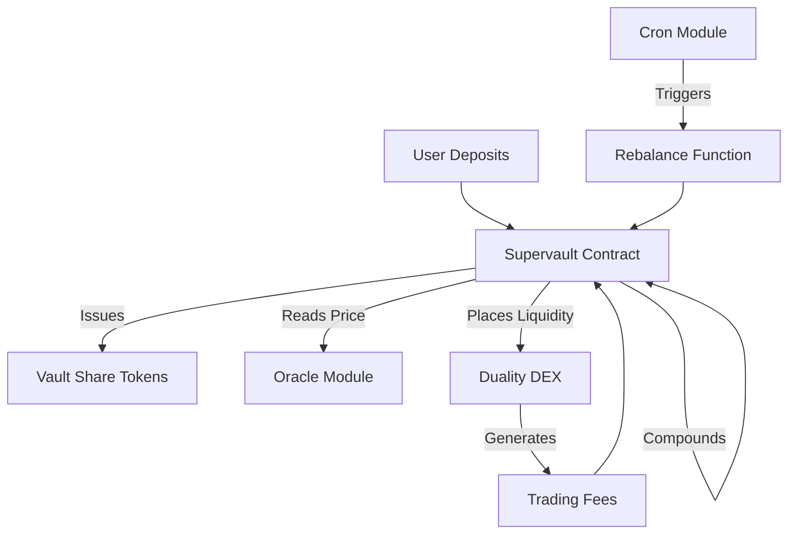

## Intelligent Liquidity Management with Supervaults

Supervaults are one of Neutron's headline DeFi innovations, representing a new approach to liquidity provisioning and yield generation that leverages Neutron's integrated infrastructure to achieve maximal capital efficiency and improve trader outcomes.

## What are Supervaults?

  At their core, Supervaults are smart contracts that manage liquidity on behalf of users across one or more venues, with advanced strategies that dynamically adjust to market conditions in real-time.

Unlike traditional yield vaults or static liquidity pools, Supervaults actively optimize capital deployment to:

- Minimize slippage for traders
- Maximize fees earned by liquidity providers
- Reduce impermanent loss through dynamic position management
- Layer multiple yield sources for enhanced returns

  

    <h3 className="text-xl font-semibold mb-2">For Liquidity Providers</h3>
    
Supervaults offer enhanced returns through strategic liquidity placement, fee optimization, and potential reduction of impermanent loss.

  

  
  

    <h3 className="text-xl font-semibold mb-2">For Traders</h3>
    
Supervaults provide deeper liquidity at current price points, resulting in significantly reduced slippage for large trades and better execution quality.

  

## How Supervaults Work

Supervaults are integrated with Neutron's core modules to enable continuous, trustless operation:

### Dynamic Positioning with Oracle and Cron

  

    <h4 className="font-semibold mb-2">1. Oracle Integration</h4>
    
Supervaults leverage Neutron's high-frequency oracle to receive accurate price data every block, enabling precise liquidity positioning.

  

  
  

    <h4 className="font-semibold mb-2">2. Automated Rebalancing</h4>
    
The Cron module triggers rebalancing operations when needed, allowing vaults to reposition liquidity as market conditions change without requiring off-chain bots.

  

  
  

    <h4 className="font-semibold mb-2">3. Capital Deployment</h4>
    
Liquidity is concentrated around current market prices, maximizing efficiency and ensuring capital is always productively deployed.

  

### Technical Architecture

When a user deposits assets into a Supervault:

1. The vault issues share tokens representing their proportional ownership
2. The contract reads the current price from Neutron's Oracle
3. Liquidity is strategically deployed into Duality DEX around the current price
4. As prices move, Cron triggers rebalancing, moving liquidity to new optimal ranges
5. Trading fees are collected and can be compounded or distributed to shareholders

All of this happens on-chain, with no reliance on external keepers or off-chain infrastructure, ensuring maximum reliability and minimizing operational risk.

## Capital Efficiency Advantages

Supervaults achieve exceptional capital efficiency through several mechanisms:

  

    <h3 className="text-xl font-semibold mb-2">Concentrated Liquidity</h3>
    
Unlike passive AMMs that spread liquidity across wide price ranges, Supervaults focus capital precisely where it's needed, around current market prices.

  

  
  

    <h3 className="text-xl font-semibold mb-2">Multi-Asset Strategies</h3>
    
Supervaults can manage complex positions across multiple asset pairs, optimizing for overall portfolio returns rather than individual pairings.

  

  
  

    <h3 className="text-xl font-semibold mb-2">Yield Compounding</h3>
    
Through automated reinvestment of earned fees, Supervaults maximize the compounding effect for long-term holders.

  

  
  

    <h3 className="text-xl font-semibold mb-2">Multi-Layer Yield</h3>
    
By integrating with other DeFi primitives, Supervaults can layer multiple yield sources on the same capital, such as trading fees, staking rewards, and incentives.

  

## Comparison to Traditional Approaches

  <table className="min-w-full border border-gray-300 dark:border-gray-700">
    <thead>
      <tr className="bg-gray-100 dark:bg-gray-800">
        <th className="p-3 text-left">Feature</th>
        <th className="p-3 text-left">Standard AMM (e.g., Uniswap v2)</th>
        <th className="p-3 text-left">Concentrated Liquidity (e.g., Uniswap v3)</th>
        <th className="p-3 text-left">Neutron Supervaults</th>
      </tr>
    </thead>
    <tbody>
      <tr className="border-t border-gray-300 dark:border-gray-700">
        <td className="p-3 font-medium">Liquidity Positioning</td>
        <td className="p-3">Passive, across infinite price range</td>
        <td className="p-3">Manual selection of price ranges</td>
        <td className="p-3">Automated dynamic positioning</td>
      </tr>
      <tr className="border-t border-gray-300 dark:border-gray-700 bg-gray-50 dark:bg-gray-900">
        <td className="p-3 font-medium">Capital Efficiency</td>
        <td className="p-3">Low</td>
        <td className="p-3">Medium to High (if managed well)</td>
        <td className="p-3">Very High</td>
      </tr>
      <tr className="border-t border-gray-300 dark:border-gray-700">
        <td className="p-3 font-medium">Management</td>
        <td className="p-3">None needed</td>
        <td className="p-3">Manual or via third-party services</td>
        <td className="p-3">Fully automated on-chain</td>
      </tr>
      <tr className="border-t border-gray-300 dark:border-gray-700 bg-gray-50 dark:bg-gray-900">
        <td className="p-3 font-medium">LP Experience</td>
        <td className="p-3">Simple but inefficient</td>
        <td className="p-3">Complex, requires active monitoring</td>
        <td className="p-3">Simple deposit with high efficiency</td>
      </tr>
      <tr className="border-t border-gray-300 dark:border-gray-700">
        <td className="p-3 font-medium">Oracle Integration</td>
        <td className="p-3">None</td>
        <td className="p-3">Third-party (if any)</td>
        <td className="p-3">Native high-frequency oracle</td>
      </tr>
    </tbody>
  </table>

## Get Started with Supervaults

  <a className="flex flex-col p-5 border border-gray-200 dark:border-gray-800 rounded-lg hover:bg-gray-50 dark:hover:bg-gray-900" href="#">
    <h4 className="font-semibold mb-2">Deposit Assets</h4>
    
Provide liquidity to earn optimized yields with minimal management

  </a>
  
  <a className="flex flex-col p-5 border border-gray-200 dark:border-gray-800 rounded-lg hover:bg-gray-50 dark:hover:bg-gray-900" href="#">
    <h4 className="font-semibold mb-2">View Analytics</h4>
    
Monitor performance metrics and yield statistics

  </a>
  
  <a className="flex flex-col p-5 border border-gray-200 dark:border-gray-800 rounded-lg hover:bg-gray-50 dark:hover:bg-gray-900" href="#">
    <h4 className="font-semibold mb-2">Trade with Low Slippage</h4>
    
Execute large trades with minimal price impact

  </a>

  <strong>Coming Soon:</strong> Additional Supervault strategies across multiple asset classes. Stay tuned for announcements on new vault deployments.

 