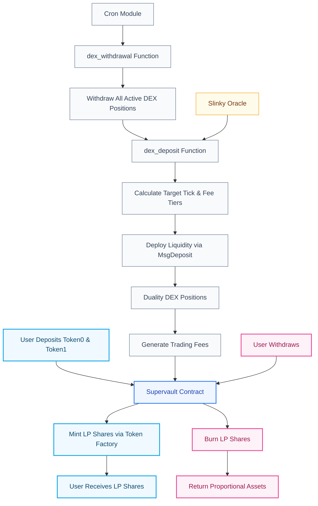

<Note> Supervaults <a href="https://app.neutron.org/supervaults" target="_blank" className="text-primary hover:underline font-bold">are now live</a>! Start earning optimized yields with automated liquidity management. Ready to get started? Check out the <a href="#how-to-deposit-into-supervaults" className="text-primary hover:underline">how-to deposit section</a> below for step-by-step instructions. Please review [Supervaults Terms](/legal/terms-and-conditions/supervaults) before participating.</Note>

## Strategic Objectives

Supervaults democratize market making profits to beat the competition on pricing and attract liquidity at scale. They achieve two key strategic goals:

1. **Offer the tightest spreads (best prices)** for on-chain spot markets in a sustainable way
2. **Maximize supply capacity** for non-USDC assets as collateral for lending/borrowing and perpetuals to unlock new trades

The design allows efficient crowdsourcing of capital to bootstrap markets, rapidly win aggregation volume, and increase lending/borrowing capacity. This leads to organic fees that sustain liquidity and enable market scaling for larger traders.

## What are Supervaults?

Supervaults are Neutron's flagship DeFi innovation that manage liquidity on behalf of users by efficiently allocating deposits into the Neutron DEX [Duality](/defi/duality).

Unlike traditional yield vaults or static liquidity pools, Supervaults actively optimize capital deployment to:

- Minimize slippage for traders through concentrated liquidity
- Maximize fees earned by liquidity providers across multiple fee tiers  
- Reduce impermanent loss through dynamic position management and rebalancing
- Bootstrap supply capacity for lending and perpetual protocols

## Key Terms

Understanding Supervaults requires familiarity with core market making concepts:

- **[Duality](/defi/duality)**: Neutron's enshrined orderbook with advanced order types designed to minimize risks and costs for market makers. Features impossible to build outside an app-specific chain.
- **[Slinky](/operators/oracle/overview)**: Neutron's enshrined, high-performance oracle operated by validators as part of consensus, guaranteeing up-to-date prices at every block for any CEX asset.
- **[Cron Module](/developers/modules/cron)**: Neutron module enabling guaranteed scheduled smart-contract execution at the start or end of each block.
- **Spread**: Price gap between highest buy order and lowest sell order. Smaller spreads mean better prices for traders. Market makers profit by buying slightly lower and selling slightly higher.
- **Adverse Selection**: Losses from arbitrageurs taking advantage of outdated pricing. Too tight spreads risk adverse selection; too wide spreads lose order flow.
- **Gas Fees**: Cost to perform on-chain computation.
- **Inventory Costs**: Costs of holding volatile/low liquidity assets from risks and opportunity cost.

The fundamental economics of market making:

$$
\text{costs of market making} = \text{gas fees} + \text{inventory costs} + \text{adverse selection}
$$

$$
\text{profit of market making} = \text{revenue} - \text{costs}
$$

## Who Benefits from Supervaults?

Supervaults create value for multiple participants in the Neutron ecosystem:

<CardGroup cols={2}>
  <Card title="For Liquidity Providers" icon="coins" iconType="duotone">
    Deposit paired tokens and receive LP share tokens representing proportional vault ownership. Earn optimized yields through strategic liquidity placement across price ranges and fee tiers.
  </Card>
  
  <Card title="For Traders" icon="chart-line" iconType="duotone">
    Supervaults provide deeper liquidity at current price points, resulting in significantly reduced slippage for large trades and better execution quality.
  </Card>
</CardGroup>

## Why Supervaults Beat Traditional AMMs

Traditional market-making is challenging on-chain due to latency, censoring incentives, and high costs (inventory, gas, and opportunity costs). Traditional AMMs use simple, static algorithms and lack external price feeds, causing them to rely on off-chain arbitrageurs to inform them about true asset prices. This results in **immense value leakage** to arbitrageurs who profit at the expense of liquidity providers.

Supervaults overcome these fundamental limitations through Neutron's unique infrastructure:

<CardGroup cols={2}>
  <Card title="Slinky Oracle Integration" icon="globe" iconType="duotone">
    Unlike traditional AMMs with no price feeds, Supervaults leverage [Slinky's](/operators/oracle/overview) high-frequency, censorship-resistant price feeds to stay current with CEX prices without leaking value to arbitrageurs.
  </Card>
  
  <Card title="Automated Cron Execution" icon="clock" iconType="duotone">
    The [Cron module](/developers/modules/cron) enables reliably automated strategies without expensive and unreliable keeper systems, eliminating gas costs and execution risks.
  </Card>
  
  <Card title="MEV Protection & Priority Access" icon="shield" iconType="duotone">
    Begin and end block execution enables high-value, order-sensitive transactions to avoid front-running while giving Supervaults priority access to arbitrage opportunities.
  </Card>
  
  <Card title="100% Capital Utilization" icon="layer-group" iconType="duotone">
    Unlike passive AMMs where large portions of liquidity sit unused far from mid-price, Supervaults actively concentrate and rebalance all liquidity around current market prices.
  </Card>
</CardGroup>

### Detailed Feature Comparison

  <table className="min-w-full border border-gray-300 dark:border-gray-700">
    <thead>
      <tr className="bg-gray-100 dark:bg-gray-800">
        <th className="p-3 text-left">Feature</th>
        <th className="p-3 text-left">Standard AMM</th>
        <th className="p-3 text-left">Concentrated Liquidity</th>
        <th className="p-3 text-left">Traditional Market Makers</th>
        <th className="p-3 text-left">Neutron Supervaults</th>
      </tr>
    </thead>
    <tbody>
      <tr className="border-t border-gray-300 dark:border-gray-700">
        <td className="p-3 font-medium">Capital Utilization</td>
        <td className="p-3">~10-20% effective</td>
        <td className="p-3">~60-80% effective</td>
        <td className="p-3">~90-95% effective</td>
        <td className="p-3 font-medium">100% effective</td>
      </tr>
      <tr className="border-t border-gray-300 dark:border-gray-700 bg-gray-50 dark:bg-gray-900">
        <td className="p-3 font-medium">Gas Costs</td>
        <td className="p-3">Low (infrequent)</td>
        <td className="p-3">Medium (rebalancing)</td>
        <td className="p-3">High (frequent updates)</td>
        <td className="p-3 font-medium">Zero (Cron exempt)</td>
      </tr>
      <tr className="border-t border-gray-300 dark:border-gray-700">
        <td className="p-3 font-medium">Adverse Selection Risk</td>
        <td className="p-3">High (no oracle)</td>
        <td className="p-3">Medium (manual updates)</td>
        <td className="p-3">Low (frequent updates)</td>
        <td className="p-3 font-medium">Minimal (per-block updates)</td>
      </tr>
      <tr className="border-t border-gray-300 dark:border-gray-700 bg-gray-50 dark:bg-gray-900">
        <td className="p-3 font-medium">Lending Integration</td>
        <td className="p-3">Limited depth</td>
        <td className="p-3">Better but fragmented</td>
        <td className="p-3">Not designed for lending</td>
        <td className="p-3 font-medium">Purpose-built (-5% depth)</td>
      </tr>
      <tr className="border-t border-gray-300 dark:border-gray-700">
        <td className="p-3 font-medium">Arbitrage Capture</td>
        <td className="p-3">Loses to arbitrageurs</td>
        <td className="p-3">Loses to arbitrageurs</td>
        <td className="p-3">Competes with arbitrageurs</td>
        <td className="p-3 font-medium">Priority capture (begin-block)</td>
      </tr>
    </tbody>
  </table>

## System Design & Market Making Strategy

### Two-Tier Liquidity Strategy

At the beginning of each block, Supervaults execute a sophisticated market making strategy:

<Steps>
  <Step title="Balance Assessment">
    The vault notes its internal token balances and checks for any imbalances between paired assets.
  </Step>
  <Step title="Price Discovery">
    Gets current token prices from Slinky oracle for precise positioning calculations.
  </Step>
  <Step title="Tight Spread Deployment">
    Provides primary liquidity at tight spreads around the current Slinky price for optimal trading.
  </Step>
  <Step title="Reserve Liquidity Deployment">
    Deploys remaining liquidity at larger spreads (~±5% depth) to bootstrap supply capacity for lending protocols.
  </Step>
</Steps>

### Reserve Liquidity for Lending Protocols

Unlike traditional market making where reserve liquidity remains unused, Supervaults strategically provide it at ~±5% depth to bootstrap **supply capacity** for lending/borrowing protocols.

Mars Protocol's risk methodology determines collateral caps by examining how much of an asset can be atomically traded into USDC. Since Mars liquidation bounties are 5% above debt value, they specifically examine -5% depth liquidity.

**Benefits for the ecosystem:**
- **20x higher collateral caps** for Mars compared to XYK pools
- **Enhanced LP profitability**: LPs buy liquidated assets at ~5% discounts (potentially 5% APY in single trades)
- **Significant gains** compared to concentrated liquidity approaches

At each block's end, vaults withdraw all liquidity and redeploy at fresh Slinky prices with optimized spreads.

### Smart Rebalancing

When demand imbalances occur (more of one asset than the other), Supervaults automatically rebalance by offering more of the oversupplied token at the tightest spreads. This increases supply of the oversupplied asset and gradually brings the vault back to parity.

### Priority Arbitrage Capture

When Duality orderbook prices diverge from Slinky prices, arbitrage opportunities emerge. Since Supervaults operate at the beginning of each block, they have **priority access** to capture this arbitrage before other market participants.

The vault purchases mispriced liquidity using its reserves, then continues normal liquidity deployment. This "vault-owned-MEV" generates additional profits for liquidity providers while keeping arbitrage value within the ecosystem.

## How Supervaults Work

### User Experience

<CardGroup cols={2}>
  <Card title="Deposit Process" icon="wallet" iconType="duotone">
    Users deposit paired tokens (token0 and token1) and receive LP shares minted via Neutron's token factory module, representing their proportional claim on the vault's total value.
  </Card>
  
  <Card title="Withdrawal Process" icon="money-bill-transfer" iconType="duotone">
    Users redeem LP shares to withdraw their proportional share of vault assets. The vault handles complex DEX position management automatically during withdrawals.
  </Card>
</CardGroup>

### Technical Implementation

Each block, Supervaults execute a precise rebalancing sequence:

1. **dex_withdrawal()**: Withdraw all active DEX positions owned by the vault
2. **dex_deposit()**: Fetch fresh prices from Slinky oracle and recompute optimal liquidity deployment
3. **Strategic Positioning**: Deploy liquidity across multiple price ranges based on fee tier allocation, token imbalance, and configured parameters
4. **Full Custody**: The vault maintains complete custody of all funds throughout the process

## How to Deposit Into Supervaults

Follow these simple steps to start earning optimized yields with Supervaults:

<Steps>
  <Step title="Connect Your Wallet">
    Navigate to the [Neutron Web Application](https://app.neutron.org/supervaults) and click the **Connect** button at the top right to connect your preferred wallet.
  </Step>
  <Step title="Access Supervaults">
    Select the **Supervaults** tab from the left side menu to view all available vault pairs.
  </Step>
  <Step title="Choose Your Vault">
    Select from the list of available Supervaults. Each vault shows:
    - Current TVL (Total Value Locked)
    - APY (Annual Percentage Yield)
    - Deposit cap status
    - Asset pair information
  </Step>
  <Step title="Deposit Assets">
    Supervaults support both single-sided and double-sided liquidity provision:
    - **Single-sided**: Deposit only one asset (e.g., just ATOM or just USDC)
    - **Double-sided**: Deposit both assets in the pair proportionally

    Select the amount of each asset you want to deposit and click **Deposit**.
  </Step>
  <Step title="Monitor Your Position">
    Once deposited, you can:
    - Track your position's TVL in the "My Position TVL" chart
    - Monitor vault performance and rebalancing activity
    - View your proportional share of vault rewards
  </Step>
  <Step title="Withdraw When Ready">
    To withdraw funds:
    1. Navigate to your deposited vault pair
    2. Select **Withdraw**
    3. Choose the amount to withdraw
    4. Confirm the transaction
  </Step>
</Steps>

<Note> Withdrawals are on a pro-rata basis from the total vault value and will return proportional amounts of both assets in the pair. </Note>

## Ecosystem Integration & Strategic Impact

### Unified Liquidity on Duality Orderbook

Supervaults provide liquidity to Duality, Neutron's enshrined orderbook, which aggregates liquidity from multiple sources:

<CardGroup cols={3}>
  <Card title="Supervaults" icon="vault" iconType="duotone">
    Automated market making with CEX-grade pricing and tight spreads
  </Card>
  <Card title="Astroport AMMs" icon="arrows-rotate" iconType="duotone">
    PCL and other automated market maker strategies
  </Card>
  <Card title="Professional MMs" icon="chart-line" iconType="duotone">
    Traditional market makers and limit orders
  </Card>
</CardGroup>

This unified approach enables the orderbook to offer tighter spreads, higher depth, and internalized arbitrage profits.

### Arbitrage Internalization Benefits

**Traditional Fragmented Approach:**
- AMM pools (Astroport, Astrovault) operate independently
- Rely on sophisticated third-parties for CEX/DEX arbitrage
- Pay integration costs for aggregator availability, liquidation routing, and front-end integrations
- **Value continuously leaks** to external arbitrageurs and service providers

**Neutron's Unified Approach:**
- All AMMs compile onto the same Duality orderbook
- Every market making strategy benefits from shared volume without individual integration costs
- Supervaults conduct automatic CEX/DEX arbitrage by trading against mispriced liquidity
- **Arbitrage profits stay within the ecosystem** and compound back into the orderbook

## Risk Management

Understanding potential risks helps users make informed decisions about Supervault participation:

  <table className="min-w-full border border-gray-300 dark:border-gray-700">
    <thead>
      <tr className="bg-gray-100 dark:bg-gray-800">
        <th className="p-3 text-left">Risk Category</th>
        <th className="p-3 text-left">Potential Impact</th>
        <th className="p-3 text-left">Mitigation Strategies</th>
      </tr>
    </thead>
    <tbody>
      <tr className="border-t border-gray-300 dark:border-gray-700">
        <td className="p-3 font-medium">Smart Contract</td>
        <td className="p-3">
          • UX degradation 
          • Stuck funds 
          • Loss of funds (exploit/hack)
        </td>
        <td className="p-3">
          • Best development practices 
          • Comprehensive audits 
          • Bridge rate limits 
          • Governance-enforced contract migration
        </td>
      </tr>
      <tr className="border-t border-gray-300 dark:border-gray-700 bg-gray-50 dark:bg-gray-900">
        <td className="p-3 font-medium">Oracle</td>
        <td className="p-3">
          • Performance degradation 
          • APR degradation
        </td>
        <td className="p-3">
          • Prices sourced across numerous CEXs/providers 
          • Aggregated across all validators 
          • Redundant price feeds
        </td>
      </tr>
      <tr className="border-t border-gray-300 dark:border-gray-700">
        <td className="p-3 font-medium">Platform</td>
        <td className="p-3">
          • UX degradation 
          • Performance degradation
        </td>
        <td className="p-3">
          • Best development practices 
          • Regular audits 
          • Social coordination for restart/upgrade
        </td>
      </tr>
    </tbody>
  </table>

## Vault Performance Calculations

Understanding how Supervault performance is measured helps users make informed investment decisions and interpret the metrics displayed in the interface.

### 30D APY/Hold

The primary metric for calculating vault returns is **APY vs Hold**. This compares the returns of the vault to holding a 50/50 portfolio of the underlying assets.

Looking at the last 30 days, we calculate total returns for the vault ignoring new deposits and withdrawals:

$$
vault\_return\_30d = (tvl\_close + value\_withdrawals) - (tvl\_open + value\_deposits)
$$

We then compare this to the 30-day returns for holding an equivalent value of the two underlying vault assets. The resulting value is annualized to produce the final 30D APY/Hold value:

$$
\Bigg( \dfrac{1 + vault\_return\_30d}{1 + hold\_return\_30d}  \Bigg)^{\tfrac{365}{30}} - 1
$$

<Info>
**APY vs Hold** shows whether the active market making strategy outperformed a simple buy-and-hold approach, accounting for fees earned minus any impermanent loss effects.
</Info>

### Volume (Vol)

Volume represents the total amount of trading activity for a vault, encompassing two types:

1. **Maker Volume**: When the vault provides liquidity that other users trade through
2. **Taker Volume**: When the vault trades through existing liquidity on the orderbook

Higher volume generally correlates with increased fee generation and better vault performance.

### Total Value Locked (TVL)

TVL is the total value of tokens in the vault, effectively representing the sum of net deposits and accumulated vault revenue. This metric indicates:

- The scale of the vault's operations
- Market confidence in the vault strategy
- Available liquidity for traders

### Vault Capacity

Most vaults have a maximum deposit capacity to optimize capital efficiency and maintain high APYs. When TVL equals or exceeds vault capacity, new deposits are temporarily disabled.

**Benefits of capacity limits:**
- Ensures optimal capital utilization
- Maintains competitive APY rates
- Prevents dilution of returns for existing depositors

### Pool Balance

Pool balance represents the current amount of each token held by the vault. Key implications:

- **Withdrawal proportions**: Users receive their pro-rata share of vault TVL in the current pool balance ratio
- **Imbalance risk**: Higher imbalances indicate greater inventory risk, where the over-supplied token's market performance disproportionately affects vault APY
- **Rebalancing indicators**: Shows how effectively the vault's automated rebalancing maintains target allocations

<Tip>
Monitor pool balance ratios to understand your withdrawal composition and assess the vault's current risk profile.
</Tip>

## Technical Architecture

```mermaid
graph TD
    A[User Deposits Token0 & Token1] --> B[Supervault Contract]
    B --> C[Mint LP Shares via Token Factory]
    C --> D[User Receives LP Shares]
    
    E[Cron Module] --> F[dex_withdrawal Function]
    F --> G[Withdraw All Active DEX Positions]
    G --> H[dex_deposit Function]
    
    I[Slinky Oracle] --> H
    H --> J[Calculate Target Tick & Fee Tiers]
    J --> K[Deploy Liquidity via MsgDeposit]
    K --> L[Duality DEX Positions]
    
    L --> M[Generate Trading Fees]
    M --> B
    
    N[User Withdraws] --> B
    B --> O[Burn LP Shares]
    O --> P[Return Proportional Assets]
    
    classDef default fill:#fafafa,stroke:#525252,stroke-width:1px,color:#262626
    classDef depositFlow fill:#f0f9ff,stroke:#0ea5e9,stroke-width:2px,color:#0c4a6e
    classDef withdrawalFlow fill:#fdf2f8,stroke:#ec4899,stroke-width:2px,color:#9d174d
    classDef coreContract fill:#eff6ff,stroke:#3b82f6,stroke-width:2px,color:#1e40af
    classDef oracle fill:#fffbeb,stroke:#f59e0b,stroke-width:1px,color:#78350f
    classDef dex fill:#f8fafc,stroke:#64748b,stroke-width:1px,color:#334155
    
    class A,C,D depositFlow
    class N,O,P withdrawalFlow
    class B coreContract
    class I oracle
    class E,F,G,H,J,K,L,M dex
```

<Note>
**In Summary**:
Supervaults represent the cutting edge of automated market making, combining Neutron's integrated modules (Cron, Slinky Oracle, Token Factory, and Duality DEX) into a unified liquidity management system that operates trustlessly without external dependencies.
</Note>