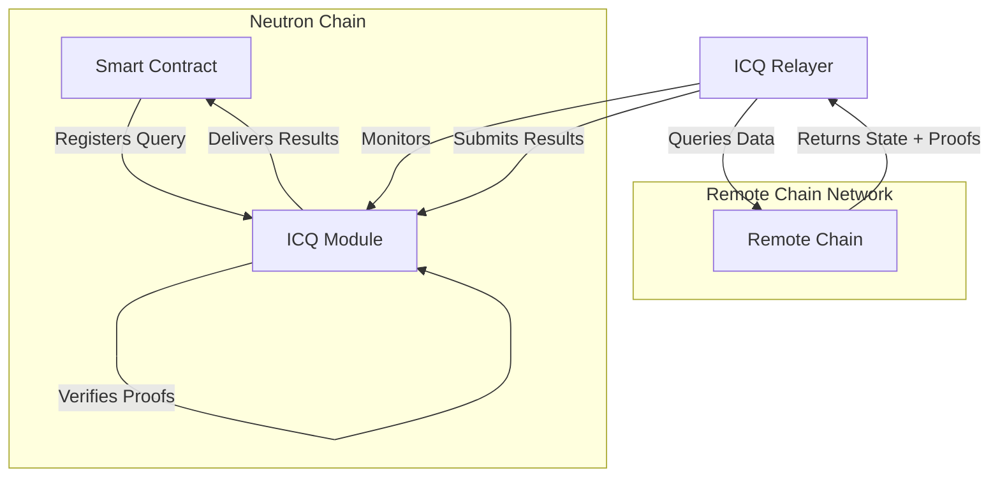
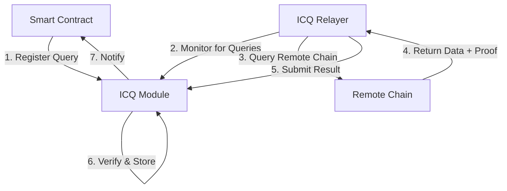
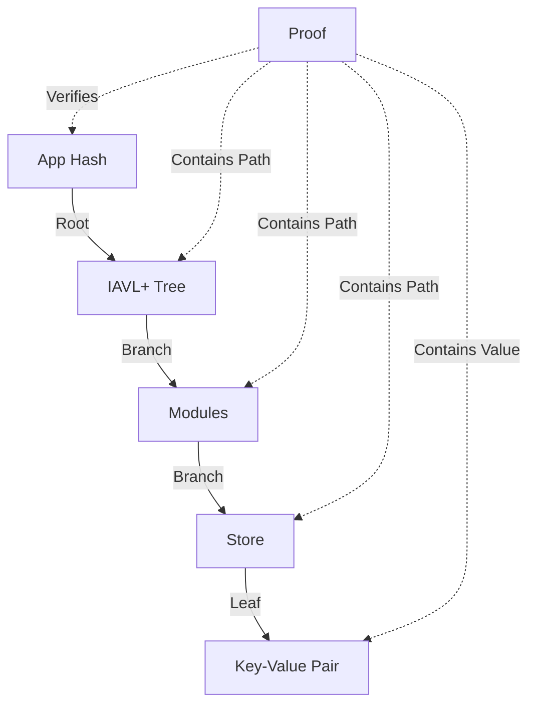

# Interchain Queries: Concepts and Architecture

This page provides a deep dive into how the Interchain Queries (ICQ) module works under the hood, explaining the architectural components, verification mechanisms, and security model.

## Architectural Components

The Interchain Queries system consists of several components working together:



### 1. ICQ Module

The core on-chain component responsible for:
- Registering and tracking queries
- Verifying cryptographic proofs
- Storing results (for KV queries)
- Delivering results to contracts
- Managing deposits and timeouts

### 2. ICQ Relayers

Off-chain services that:
- Monitor the Neutron chain for registered queries
- Connect to remote chains to fetch requested data
- Generate and submit cryptographic proofs
- Handle retries and error conditions

### 3. Smart Contracts

User-deployed contracts that:
- Register queries for remote chain data
- Process query results through sudo callbacks
- Implement business logic based on cross-chain data

### 4. Remote Chains

IBC-connected blockchains that:
- Maintain state that can be queried
- Provide cryptographic proofs of their state
- Support IBC protocol standards

## How Interchain Queries Work

### Internal Architecture

The Interchain Queries module consists of several key components working together to enable cross-chain data verification:



### Integration with IBC

The Interchain Queries module relies on the Inter-Blockchain Communication (IBC) protocol to establish secure connections between chains. It uses IBC light clients to verify the cryptographic proofs of state inclusion.

Unlike direct IBC packets, ICQ doesn't send messages directly to remote chains. Instead, it:
1. Uses IBC connection information to identify the remote chain
2. Retrieves the remote chain's consensus state through the IBC client
3. Verifies proofs against this consensus state

## Query Lifecycle

### Registration Phase

1. A smart contract initiates a query registration by specifying:
   - Connection ID: Identifies the IBC connection to the target chain
   - Chain ID: Identifies the specific chain to query
   - Query details: Either KV keys or transaction filters
   - Update period: How frequently the query should be refreshed

2. The ICQ module:
   - Charges a deposit (configurable via governance)
   - Assigns a unique query ID
   - Records the query details and owner
   - Emits an event for relayers to detect

### Execution Phase

3. ICQ relayers detect the new query registration and:
   - Connect to the target chain
   - Execute the appropriate query (KV or transaction search)
   - Generate cryptographic proofs of the results
   - Submit the results and proofs back to Neutron

4. The ICQ module:
   - Verifies the cryptographic proofs
   - For KV queries, stores the verified result
   - Calls the appropriate sudo method on the originating contract

### Maintenance Phase

5. Based on the update period, relayers periodically:
   - Re-fetch data from the remote chain
   - Submit updated results to keep the data fresh

6. The contract or any user can:
   - Update the query parameters
   - Remove the query when no longer needed
   - Reclaim the deposit (if owner)

## Verification Mechanisms

### KV Query Verification

For KV queries, the module verifies IAVL Merkle proofs:

```
                  AppHash
                     |
               IAVL RootHash
                /         \
               /           \
        Module1Hash      Module2Hash
           /                 \
     StoreValue           StoreValue
```

1. Each Cosmos SDK module has its own IAVL store
2. The Merkle proof shows a path from the app hash to the requested value
3. The verification checks that the path is valid and leads to the claimed value

KV queries use **IAVL+ Merkle proofs** to verify state from remote chains:

1. Each Cosmos SDK-based chain maintains a Merkle tree of its state
2. When a relayer queries a KV pair, it receives both the value and a proof
3. The proof contains all hashes needed to reconstruct the path from the KV pair to the root
4. The ICQ module verifies this proof against the chain's latest verified app hash
5. If verification succeeds, the value is guaranteed to be part of the remote chain's state

<div className="p-4 border-l-4 border-primary bg-primary/5 rounded my-6">
  <strong>Technical detail:</strong> The verification uses the ICS23 standard for proving existence of key-value pairs in Merkle trees. This is the same standard used by IBC for cross-chain verification.
</div>



### TX Query Verification

Transaction queries use a combination of techniques:

1. Relayers fetch matching transactions from the remote chain's indexed events
2. They obtain block headers and Merkle proofs for each transaction
3. The ICQ module verifies:
   - The block headers are valid (signed by sufficient validator power)
   - The transactions exist within those blocks (via Merkle proofs)
   - The block headers form a valid sequence linked to a trusted header

For TX queries, the verification is more complex:

1. Verify block headers using the IBC light client
2. For each transaction:
   - Verify the transaction was included in the block using a Merkle proof
   - Verify the transaction result was included in the following block's LastResultsHash

This process verifies transaction existence without trusting the relayer's filtering.

<div className="p-4 border-l-4 border-yellow-400 bg-yellow-50 dark:bg-yellow-900/20 rounded mb-6">
  <strong>Security note:</strong> While the ICQ module verifies that transactions exist, it cannot verify that they match the specified filters. The filtering happens at the relayer level, which is why contracts must implement additional validation of transaction contents.
</div>

## Security Model

The ICQ module's security relies on several layers of protection:

### Cryptographic Verification

- All data is cryptographically verified using Merkle proofs
- Verification is performed against trusted chain headers
- No reliance on honest relayers for data integrity

### Economic Security

- Query registration requires a deposit
- Deposit is only refundable to the query owner until timeout
- After timeout, anyone can clean up unused queries and claim the deposit
- This incentivizes proper resource management and prevents spam

### Permissionless Relaying

- Any entity can act as a relayer
- Competition among relayers ensures data freshness
- No single point of failure in the relayer network
- Redundancy improves system reliability

### Timeout Mechanism

- Queries have an update period and a timeout period
- If a query isn't updated within `query_submit_timeout` blocks, it's considered inactive
- This prevents abandoned queries from consuming chain resources indefinitely

## Query Deposit System

The deposit system serves multiple purposes:

1. **Resource Management**: Ensuring chain resources aren't wasted on useless queries
2. **Economic Security**: Preventing spam and DoS attacks via query registration
3. **Incentivization**: Encouraging cleanup of unused queries

Here's how it works:

- When registering a query, the owner deposits `query_deposit` (default: 100untrn)
- This deposit remains locked until the query is removed
- Query removal permissions depend on activity status:
  - If the query is active (updated within `query_submit_timeout`), only the owner can remove it and reclaim the deposit
  - If the query is inactive (not updated within `query_submit_timeout`), anyone can remove it and claim the deposit as a reward

This mechanism creates a market-based approach to chain cleanup, as unused queries will eventually be removed by profit-seeking participants.

## Gas and Resource Management

To prevent abuse, the module implements several resource management mechanisms:

1. **Gas Limits**: Each query result processing has a gas limit
2. **Size Limits**: Maximum allowed size for keys, filters, and results
3. **Update Period**: Minimum blocks between query updates
4. **Timeout**: Maximum period for query inactivity before it can be forcibly removed

## Advanced Concepts

### Query Update Frequency

The update frequency is controlled by two parameters:

1. `update_period`: Minimum blocks between updates for a specific query
2. `min_update_period`: Global minimum for any query's update period

Relayers should not submit updates more frequently than the update period, and the module will reject results that come too quickly.

### Optimistic Updates vs. Verification

The system uses an optimistic update model:

1. Results are only verified when submitted
2. Between updates, contracts work with the last verified data
3. There's no automatic notification if remote state changes
4. The contract must set an appropriate update period based on its sensitivity to stale data

### Connection to IBC

The ICQ module leverages IBC primitives but is not a full IBC protocol:

1. It uses the same Merkle proof verification as IBC packets
2. It trusts the consensus state of remote chains tracked by IBC connections
3. However, it doesn't use IBC packets for data transport (for efficiency reasons)
4. Results are submitted directly to the ICQ module, not via IBC packets

### Memory and Storage Considerations

The ICQ module implements several limits to prevent abuse:

1. `max_query_keys`: Maximum number of keys in a single KV query
2. `tx_query_result_max_size`: Maximum size of transaction query results
3. `max_tx_query_transactions`: Maximum number of transactions returned in a result
4. `max_transactions_filters`: Maximum number of filters in a transaction query

These limits prevent excessive memory usage during verification or storage.

## Transaction Filtering

TX queries use a flexible filtering system:

1. **Queries are filtered twice**:
   - First by the relayer when querying the remote chain (using Tendermint's transaction indexer)
   - Then by the contract when processing results (for additional validation)

2. **Filter Types**:
   - Event-based filters (`transfer.recipient`, `message.module`, etc.)
   - Logical operators (`AND`, `OR` are implicit in the filter structure)
   - Comparison operators (`eq`, `gt`, `lt`, `gte`, `lte`)

## Use Case Patterns

Different architectural patterns are appropriate for different use cases:

### Push Pattern (Event-Driven)

Used for reacting to remote chain events:
- Register a TX query monitoring specific event types
- Process transactions in the callback as they occur
- Good for bridges, oracles, and cross-chain governance

### Pull Pattern (State-Based)

Used for accessing remote chain state:
- Register a KV query for specific state entries
- Periodically receive updated values
- Good for price feeds, balance monitoring, and parameter tracking

### Hybrid Pattern

Combines both approaches:
- Use TX queries to detect relevant events
- Follow up with KV queries to get detailed state
- Provides both notification and detailed data

## Known Limitations

1. **Empty Values**: Due to a [bug in ICS23](https://github.com/cosmos/ics23/issues/134), querying for empty or `nil` values is currently not supported

2. **Transaction Indexing**: Requires the remote chain to have transaction indexing enabled

3. **Chain Upgrades**: Merkle proof verification may fail during or immediately after chain upgrades due to consensus state changes

4. **Proof Size**: Large proofs (especially for deep trees) can consume significant gas

## Ensuring Data Correctness

The key security guarantee of the ICQ module comes from its cryptographic verification:

1. Data is verified against the IBC consensus state, which is maintained by a trusted set of validators 
2. Proofs ensure the data was actually included in the blockchain state
3. The relayer cannot tamper with the data without detection
4. Smart contracts should still validate the semantic meaning of the data

This creates a trustless mechanism for cross-chain data retrieval, where you don't need to trust the relayer or any intermediary.

## Next Steps

<div className="grid grid-cols-1 md:grid-cols-3 gap-6 mt-8">
  <a className="flex flex-col p-5 border border-gray-200 dark:border-gray-800 rounded-lg hover:bg-gray-50 dark:hover:bg-gray-900" href="/developers/modules/interchain-queries/how-to">
    <h4 className="font-semibold mb-2">How-to Guides</h4>
    <p className="text-sm">Practical examples of using ICQ in smart contracts</p>
  </a>
  
  <a className="flex flex-col p-5 border border-gray-200 dark:border-gray-800 rounded-lg hover:bg-gray-50 dark:hover:bg-gray-900" href="/developers/modules/interchain-queries/reference">
    <h4 className="font-semibold mb-2">Reference</h4>
    <p className="text-sm">Complete API and parameter documentation</p>
  </a>
  
  <a className="flex flex-col p-5 border border-gray-200 dark:border-gray-800 rounded-lg hover:bg-gray-50 dark:hover:bg-gray-900" href="/developers/tutorials/cosmwasm_icq">
    <h4 className="font-semibold mb-2">ICQ Tutorial</h4>
    <p className="text-sm">Build a complete cross-chain monitoring application</p>
  </a>
</div> 