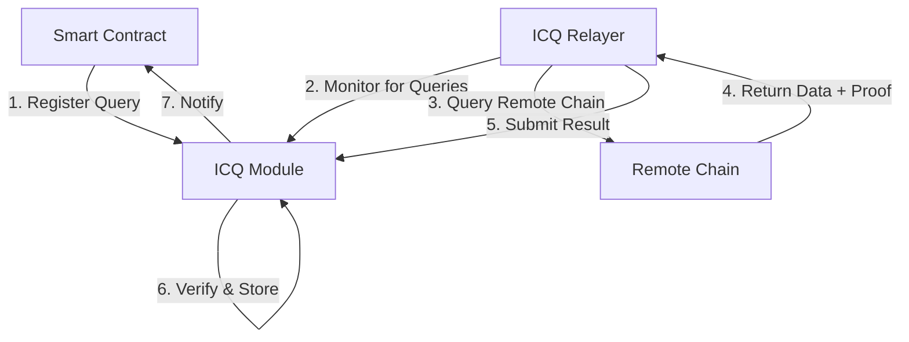

# How Interchain Queries Work

This document provides a deep dive into the Interchain Queries module, explaining how it works internally and the underlying concepts.

## Architectural Overview

The Interchain Queries module consists of several key components working together to enable cross-chain data verification:



### Components

1. **ICQ Module**: Manages query registration, result verification, and state storage
2. **ICQ Relayer**: Off-chain component that monitors for registered queries and fetches data
3. **IBC Client**: Provides consensus state for proof verification
4. **Contract Manager**: Handles callbacks to smart contracts

### Integration with IBC

The Interchain Queries module relies on the Inter-Blockchain Communication (IBC) protocol to establish secure connections between chains. It uses IBC light clients to verify the cryptographic proofs of state inclusion.

Unlike direct IBC packets, ICQ doesn't send messages directly to remote chains. Instead, it:
1. Uses IBC connection information to identify the remote chain
2. Retrieves the remote chain's consensus state through the IBC client
3. Verifies proofs against this consensus state

## Verification Mechanisms

### KV Query Verification

For KV queries, the module verifies IAVL Merkle proofs:

```
                  AppHash
                     |
               IAVL RootHash
                /         \
               /           \
        Module1Hash      Module2Hash
           /                 \
     StoreValue           StoreValue
```

1. Each Cosmos SDK module has its own IAVL store
2. The Merkle proof shows a path from the app hash to the requested value
3. The verification checks that the path is valid and leads to the claimed value

### TX Query Verification

For TX queries, the verification is more complex:

1. Verify block headers using the IBC light client
2. For each transaction:
   - Verify the transaction was included in the block using a Merkle proof
   - Verify the transaction result was included in the following block's LastResultsHash

## Query Lifecycle

1. **Registration**: A smart contract registers a query, specifying:
   - Query type (KV or TX)
   - Target data (keys or transaction filter)
   - Update period (minimum blocks between updates)
   - Connection ID to the target chain

2. **Monitoring**: The ICQ Relayer monitors for new queries and updates

3. **Data Retrieval**: When update time arrives, the relayer:
   - Queries the remote chain for the requested data
   - Retrieves the cryptographic proofs needed for verification

4. **Submission**: The relayer submits the data with proofs to Neutron

5. **Verification**: The ICQ module verifies the proof against the IBC consensus state

6. **Storage**: The verified result is stored in the module's state

7. **Notification**: For registered contracts, a sudo callback is triggered

8. **Cleanup**: Queries can be removed by their owners or by anyone after the service period

## Deposit System

The deposit system ensures proper resource management by:

1. Requiring a deposit when registering a query
2. Locking this deposit for the duration of the query's activity
3. Enabling the owner to reclaim the deposit by removing the query
4. Incentivizing efficient cleanup by allowing anyone to remove outdated queries after service period

The deposit amount is controlled by module parameters and can be adjusted through governance.

## Gas and Resource Management

To prevent abuse, the module implements several resource management mechanisms:

1. **Gas Limits**: Each query result processing has a gas limit
2. **Size Limits**: Maximum allowed size for keys, filters, and results
3. **Update Period**: Minimum blocks between query updates
4. **Timeout**: Maximum period for query inactivity before it can be forcibly removed

## Transaction Filtering

TX queries use a flexible filtering system:

1. **Queries are filtered twice**:
   - First by the relayer when querying the remote chain (using Tendermint's transaction indexer)
   - Then by the contract when processing results (for additional validation)

2. **Filter Types**:
   - Event-based filters (`transfer.recipient`, `message.module`, etc.)
   - Logical operators (`AND`, `OR` are implicit in the filter structure)
   - Comparison operators (`eq`, `gt`, `lt`, `gte`, `lte`)

## Known Limitations

1. **Empty Values**: Due to a [bug in ICS23](https://github.com/cosmos/ics23/issues/134), querying for empty or `nil` values is currently not supported

2. **Transaction Indexing**: Requires the remote chain to have transaction indexing enabled

3. **Chain Upgrades**: Merkle proof verification may fail during or immediately after chain upgrades due to consensus state changes

4. **Proof Size**: Large proofs (especially for deep trees) can consume significant gas

## Optimization Strategies

1. **Query Batching**: Group related keys into a single query to reduce overhead

2. **Minimal Update Period**: Set the update period according to your actual needs

3. **Targeted TX Filters**: Use specific filters to reduce the number of transactions returned

4. **Result Processing**: Handle large results incrementally in your contract

## Ensuring Data Correctness

The key security guarantee of the ICQ module comes from its cryptographic verification:

1. Data is verified against the IBC consensus state, which is maintained by a trusted set of validators 
2. Proofs ensure the data was actually included in the blockchain state
3. The relayer cannot tamper with the data without detection
4. Smart contracts should still validate the semantic meaning of the data

This creates a trustless mechanism for cross-chain data retrieval, where you don't need to trust the relayer or any intermediary. 